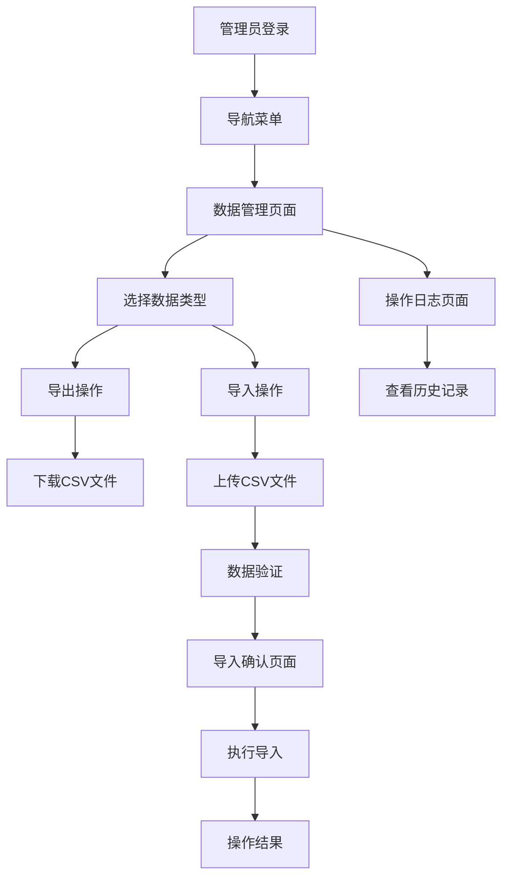

# PRMKit CSV导入导出功能需求文档

## 1. 产品概述

为PRMKit项目资源管理系统增加CSV批量导入导出功能，支持EMPLOYEE、PROJECT、TIMESHEET三个核心数据模型的批量数据操作。该功能专为L1管理员设计，提供高效的数据管理工具，支持数据备份、批量更新和系统迁移等场景。

导出的CSV文件可直接作为导入模板使用，确保数据格式的一致性和操作的便利性。

## 2. 核心功能

### 2.1 用户角色

| 角色 | 访问权限 | 核心功能 |
|------|----------|----------|
| L1管理员 | DIRECTOR, ASSOCIATE, OFFICE_ADMIN | 可访问数据管理页面，执行所有CSV导入导出操作 |
| 其他用户 | 无权限 | 无法访问数据管理功能 |

### 2.2 功能模块

本功能需求包含以下主要页面：
1. **数据管理页面**：CSV导入导出操作界面，数据预览和错误处理
2. **导入确认页面**：数据验证结果展示，批量操作确认
3. **操作日志页面**：导入导出历史记录，操作结果追踪

### 2.3 页面详情

| 页面名称 | 模块名称 | 功能描述 |
|----------|----------|----------|
| 数据管理页面 | 数据类型选择 | 选择EMPLOYEE、PROJECT、TIMESHEET数据类型进行操作 |
| 数据管理页面 | CSV导出功能 | 导出选定数据类型的完整数据，生成标准CSV文件 |
| 数据管理页面 | 模板下载 | 下载各数据类型的CSV导入模板文件 |
| 数据管理页面 | CSV导入功能 | 上传CSV文件，进行数据验证和批量导入 |
| 数据管理页面 | 数据预览 | 显示导入前的数据预览，包含验证结果和错误提示 |
| 导入确认页面 | 验证结果展示 | 显示数据验证详情，包括成功、警告、错误统计 |
| 导入确认页面 | 批量操作确认 | 确认执行批量创建、更新操作 |
| 操作日志页面 | 历史记录 | 显示所有导入导出操作的历史记录和状态 |
| 操作日志页面 | 错误日志 | 查看详细的错误信息和失败原因 |

## 3. 核心流程

### 3.1 CSV导出流程
1. L1管理员登录系统，进入数据管理页面
2. 选择要导出的数据类型（EMPLOYEE/PROJECT/TIMESHEET）
3. 设置导出条件（可选：日期范围、状态筛选等）
4. 点击导出按钮，系统生成CSV文件
5. 下载生成的CSV文件到本地

### 3.2 CSV导入流程
1. L1管理员进入数据管理页面
2. 选择要导入的数据类型
3. 上传CSV文件或下载模板文件进行编辑
4. 系统验证CSV文件格式和数据有效性
5. 显示验证结果和数据预览
6. 确认导入操作，执行批量创建/更新
7. 显示导入结果和错误报告

### 3.3 页面导航流程图

## 4. 用户界面设计

### 4.1 设计风格
- **主色调**：#2563eb（蓝色主题），#f3f4f6（浅灰背景）
- **按钮样式**：圆角按钮，主要操作使用蓝色，次要操作使用灰色
- **字体**：系统默认字体，标题使用16-18px，正文使用14px
- **布局风格**：卡片式布局，顶部导航，左右分栏设计
- **图标风格**：使用Ant Design图标库，简洁现代风格

### 4.2 页面设计概览

| 页面名称 | 模块名称 | UI元素 |
|----------|----------|--------|
| 数据管理页面 | 页面头部 | 页面标题、面包屑导航、操作按钮组 |
| 数据管理页面 | 数据类型选择 | Tab切换组件，支持EMPLOYEE/PROJECT/TIMESHEET切换 |
| 数据管理页面 | 导出区域 | 导出按钮、筛选条件表单、进度指示器 |
| 数据管理页面 | 导入区域 | 文件上传组件、模板下载链接、拖拽上传支持 |
| 数据管理页面 | 数据预览 | 表格组件显示数据，验证状态标识，错误提示 |
| 导入确认页面 | 验证结果 | 统计卡片、成功/警告/错误数量展示 |
| 导入确认页面 | 操作按钮 | 确认导入、取消操作、返回修改按钮 |
| 操作日志页面 | 日志列表 | 表格显示操作历史，状态标签，时间排序 |

### 4.3 响应式设计
- **桌面优先**：主要针对桌面端管理员操作场景设计
- **移动适配**：支持平板设备访问，手机端提供基础查看功能
- **触控优化**：按钮和交互元素适配触控操作

## 5. CSV文件格式规范

### 5.1 EMPLOYEE数据格式

| 字段名 | 中文名称 | 数据类型 | 必填 | 说明 |
|--------|----------|----------|------|------|
| employeeId | 员工ID | String | 是 | 唯一标识符 |
| name | 姓名 | String | 是 | 员工姓名 |
| email | 邮箱 | String | 是 | 登录邮箱，必须唯一 |
| role | 角色 | Enum | 是 | INTERN/JUNIOR_ARCHITECT/ARCHITECT/PROJECT_MANAGER/DIRECTOR/ASSOCIATE/OFFICE_ADMIN |
| department | 部门 | String | 否 | 所属部门 |
| hireDate | 入职日期 | Date | 否 | YYYY-MM-DD格式 |
| status | 状态 | Enum | 否 | ACTIVE/INACTIVE，默认ACTIVE |

### 5.2 PROJECT数据格式

| 字段名 | 中文名称 | 数据类型 | 必填 | 说明 |
|--------|----------|----------|------|------|
| projectCode | 项目代码 | String | 是 | 唯一标识符 |
| name | 项目名称 | String | 是 | 项目名称 |
| nickname | 项目昵称 | String | 否 | 项目简称或别名 |
| description | 项目描述 | String | 否 | 项目详细描述 |
| status | 项目状态 | Enum | 否 | ACTIVE/INACTIVE/COMPLETED，默认ACTIVE |
| startDate | 开始日期 | Date | 否 | YYYY-MM-DD格式 |
| endDate | 结束日期 | Date | 否 | YYYY-MM-DD格式 |
| budget | 预算 | Decimal | 否 | 项目预算金额 |

### 5.3 TIMESHEET数据格式

| 字段名 | 中文名称 | 数据类型 | 必填 | 说明 |
|--------|----------|----------|------|------|
| employeeId | 员工ID | String | 是 | 关联员工ID |
| projectCode | 项目代码 | String | 是 | 关联项目代码 |
| taskId | 任务ID | String | 是 | 关联任务阶段ID |
| date | 工作日期 | Date | 是 | YYYY-MM-DD格式 |
| hours | 工作小时 | Decimal | 是 | 工作时长，最多2位小数 |
| description | 工作描述 | String | 否 | 工作内容描述 |
| status | 状态 | Enum | 否 | DRAFT/SUBMITTED/APPROVED/REJECTED，默认DRAFT |

## 6. 数据验证规则

### 6.1 通用验证规则
- CSV文件编码必须为UTF-8
- 文件大小限制：最大10MB
- 单次导入记录数限制：最大1000条
- 必填字段不能为空
- 数据类型必须匹配字段定义

### 6.2 业务验证规则

#### EMPLOYEE验证
- employeeId在系统中必须唯一
- email格式必须有效且唯一
- role必须是预定义枚举值之一
- hireDate不能晚于当前日期

#### PROJECT验证
- projectCode在系统中必须唯一
- startDate不能晚于endDate
- budget必须为非负数
- status必须是预定义枚举值之一

#### TIMESHEET验证
- employeeId必须在系统中存在
- projectCode必须在系统中存在
- taskId必须在系统中存在
- date不能是未来日期
- hours必须在0.1-24.0范围内
- 同一员工同一天同一项目的工时记录不能重复

## 7. 错误处理机制

### 7.1 文件格式错误
- 文件格式不正确：提示用户上传CSV格式文件
- 编码错误：提示用户使用UTF-8编码保存文件
- 文件过大：提示用户分批导入或联系管理员

### 7.2 数据验证错误
- 必填字段缺失：标记错误行号和字段名
- 数据类型错误：提示正确的数据格式
- 业务规则违反：提供具体的错误原因和建议

### 7.3 系统错误处理
- 网络超时：提供重试机制
- 服务器错误：记录错误日志，提示用户稍后重试
- 数据库错误：回滚操作，保证数据一致性

## 8. 成功反馈机制

### 8.1 导入成功反馈
- 显示成功导入的记录数量
- 提供详细的操作摘要
- 显示跳过或更新的记录统计

### 8.2 导出成功反馈
- 显示导出的记录数量
- 提供文件下载链接
- 显示导出完成时间

### 8.3 操作日志记录
- 记录所有导入导出操作
- 保存操作用户、时间、结果
- 提供操作历史查询功能