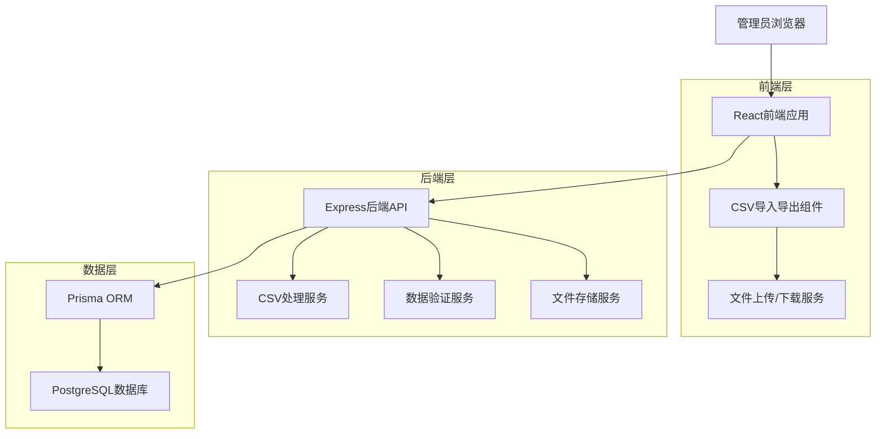
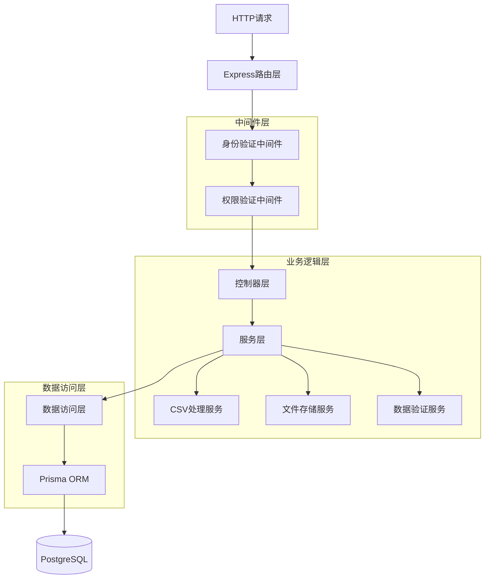
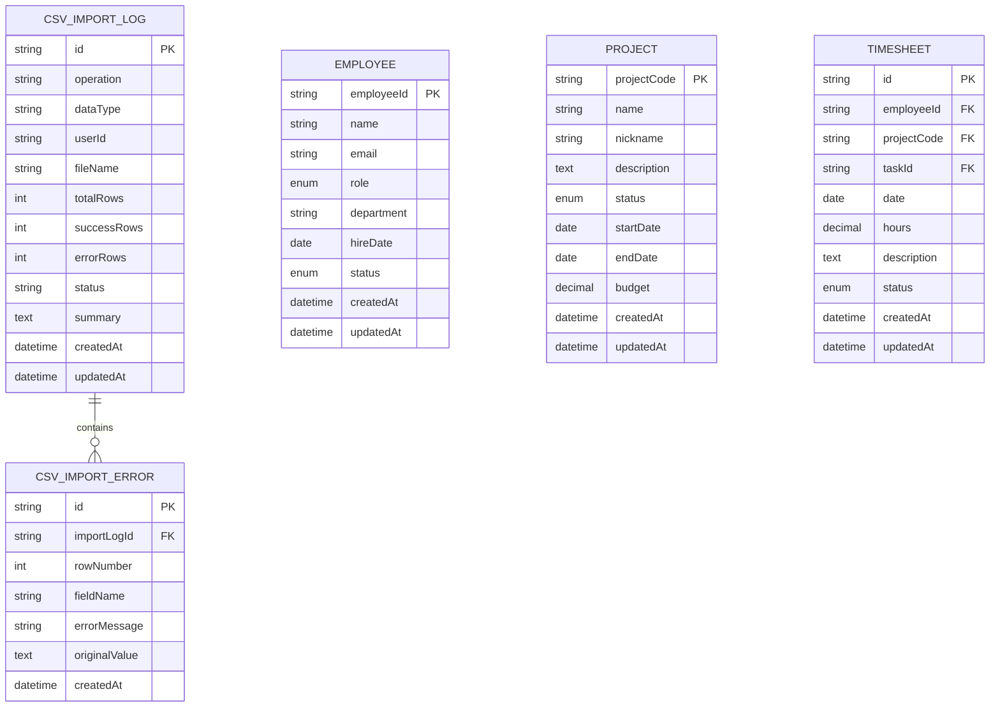

# PRMKit CSV导入导出功能技术架构文档

## 1. 架构设计



## 2. 技术描述

- **前端**: React@18 + Ant Design@5 + TypeScript + Vite
- **后端**: Express@4 + TypeScript + Multer (文件上传)
- **数据库**: PostgreSQL (通过Prisma ORM)
- **文件处理**: csv-parser + csv-writer + papaparse
- **验证**: joi + custom validation rules
- **文件存储**: 本地文件系统 (可扩展至云存储)

## 3. 路由定义

| 路由 | 用途 |
|------|------|
| /admin/data-management | 数据管理主页面，提供CSV导入导出操作界面 |
| /admin/data-management/import-confirm | 导入确认页面，显示验证结果和操作确认 |
| /admin/data-management/logs | 操作日志页面，查看导入导出历史记录 |

## 4. API接口定义

### 4.1 CSV导出API

**员工数据导出**
```
GET /api/admin/csv/export/employees
```

请求参数:
| 参数名 | 参数类型 | 是否必填 | 描述 |
|--------|----------|----------|------|
| format | string | 否 | 导出格式，默认'csv' |
| status | string | 否 | 员工状态筛选 |
| department | string | 否 | 部门筛选 |

响应:
| 参数名 | 参数类型 | 描述 |
|--------|----------|------|
| file | blob | CSV文件流 |
| filename | string | 文件名 |

**项目数据导出**
```
GET /api/admin/csv/export/projects
```

请求参数:
| 参数名 | 参数类型 | 是否必填 | 描述 |
|--------|----------|----------|------|
| status | string | 否 | 项目状态筛选 |
| startDate | string | 否 | 开始日期筛选 |
| endDate | string | 否 | 结束日期筛选 |

**工时数据导出**
```
GET /api/admin/csv/export/timesheets
```

请求参数:
| 参数名 | 参数类型 | 是否必填 | 描述 |
|--------|----------|----------|------|
| employeeId | string | 否 | 员工ID筛选 |
| projectCode | string | 否 | 项目代码筛选 |
| dateFrom | string | 否 | 开始日期 |
| dateTo | string | 否 | 结束日期 |
| status | string | 否 | 状态筛选 |

### 4.2 CSV导入API

**文件上传和验证**
```
POST /api/admin/csv/validate
```

请求:
| 参数名 | 参数类型 | 是否必填 | 描述 |
|--------|----------|----------|------|
| file | File | 是 | CSV文件 |
| dataType | string | 是 | 数据类型: 'employees'/'projects'/'timesheets' |

响应:
```json
{
  "success": true,
  "data": {
    "validationId": "uuid-string",
    "totalRows": 100,
    "validRows": 95,
    "errorRows": 5,
    "warnings": 2,
    "errors": [
      {
        "row": 3,
        "field": "email",
        "message": "Invalid email format",
        "value": "invalid-email"
      }
    ],
    "preview": [
      {
        "row": 1,
        "data": {"employeeId": "E001", "name": "张三"},
        "status": "valid"
      }
    ]
  }
}
```

**执行导入**
```
POST /api/admin/csv/import
```

请求:
| 参数名 | 参数类型 | 是否必填 | 描述 |
|--------|----------|----------|------|
| validationId | string | 是 | 验证ID |
| dataType | string | 是 | 数据类型 |
| operation | string | 是 | 操作类型: 'create'/'update'/'upsert' |

响应:
```json
{
  "success": true,
  "data": {
    "importId": "uuid-string",
    "totalProcessed": 95,
    "created": 80,
    "updated": 15,
    "failed": 0,
    "summary": "Successfully imported 95 records"
  }
}
```

### 4.3 模板下载API

**下载导入模板**
```
GET /api/admin/csv/template/:dataType
```

路径参数:
| 参数名 | 参数类型 | 描述 |
|--------|----------|------|
| dataType | string | 数据类型: 'employees'/'projects'/'timesheets' |

### 4.4 操作日志API

**获取操作日志**
```
GET /api/admin/csv/logs
```

请求参数:
| 参数名 | 参数类型 | 是否必填 | 描述 |
|--------|----------|----------|------|
| page | number | 否 | 页码，默认1 |
| limit | number | 否 | 每页数量，默认20 |
| operation | string | 否 | 操作类型筛选 |
| dataType | string | 否 | 数据类型筛选 |

响应:
```json
{
  "success": true,
  "data": {
    "logs": [
      {
        "id": "uuid",
        "operation": "import",
        "dataType": "employees",
        "userId": "user-id",
        "userName": "管理员",
        "status": "success",
        "totalRows": 100,
        "successRows": 95,
        "errorRows": 5,
        "createdAt": "2024-01-01T10:00:00Z",
        "summary": "导入员工数据"
      }
    ],
    "pagination": {
      "page": 1,
      "limit": 20,
      "total": 50,
      "totalPages": 3
    }
  }
}
```

## 5. 服务器架构图



## 6. 数据模型

### 6.1 数据模型定义



### 6.2 数据定义语言

**CSV导入日志表 (csv_import_logs)**
```sql
-- 创建CSV导入日志表
CREATE TABLE csv_import_logs (
    id UUID PRIMARY KEY DEFAULT gen_random_uuid(),
    operation VARCHAR(20) NOT NULL CHECK (operation IN ('import', 'export')),
    data_type VARCHAR(20) NOT NULL CHECK (data_type IN ('employees', 'projects', 'timesheets')),
    user_id UUID NOT NULL,
    user_name VARCHAR(100) NOT NULL,
    file_name VARCHAR(255),
    total_rows INTEGER DEFAULT 0,
    success_rows INTEGER DEFAULT 0,
    error_rows INTEGER DEFAULT 0,
    status VARCHAR(20) NOT NULL CHECK (status IN ('pending', 'processing', 'success', 'failed')),
    summary TEXT,
    created_at TIMESTAMP WITH TIME ZONE DEFAULT NOW(),
    updated_at TIMESTAMP WITH TIME ZONE DEFAULT NOW()
);

-- 创建索引
CREATE INDEX idx_csv_import_logs_user_id ON csv_import_logs(user_id);
CREATE INDEX idx_csv_import_logs_created_at ON csv_import_logs(created_at DESC);
CREATE INDEX idx_csv_import_logs_operation ON csv_import_logs(operation);
CREATE INDEX idx_csv_import_logs_data_type ON csv_import_logs(data_type);
```

**CSV导入错误表 (csv_import_errors)**
```sql
-- 创建CSV导入错误表
CREATE TABLE csv_import_errors (
    id UUID PRIMARY KEY DEFAULT gen_random_uuid(),
    import_log_id UUID NOT NULL REFERENCES csv_import_logs(id) ON DELETE CASCADE,
    row_number INTEGER NOT NULL,
    field_name VARCHAR(100),
    error_message TEXT NOT NULL,
    original_value TEXT,
    created_at TIMESTAMP WITH TIME ZONE DEFAULT NOW()
);

-- 创建索引
CREATE INDEX idx_csv_import_errors_log_id ON csv_import_errors(import_log_id);
CREATE INDEX idx_csv_import_errors_row_number ON csv_import_errors(row_number);
```

**更新Prisma Schema**
```prisma
// 在prisma/schema.prisma中添加新模型
model CsvImportLog {
  id          String   @id @default(cuid())
  operation   String   // 'import' | 'export'
  dataType    String   // 'employees' | 'projects' | 'timesheets'
  userId      String
  userName    String
  fileName    String?
  totalRows   Int      @default(0)
  successRows Int      @default(0)
  errorRows   Int      @default(0)
  status      String   // 'pending' | 'processing' | 'success' | 'failed'
  summary     String?
  createdAt   DateTime @default(now())
  updatedAt   DateTime @updatedAt
  
  errors CsvImportError[]
  
  @@map("csv_import_logs")
}

model CsvImportError {
  id            String   @id @default(cuid())
  importLogId   String
  rowNumber     Int
  fieldName     String?
  errorMessage  String
  originalValue String?
  createdAt     DateTime @default(now())
  
  importLog CsvImportLog @relation(fields: [importLogId], references: [id], onDelete: Cascade)
  
  @@map("csv_import_errors")
}
```

**初始化数据**
```sql
-- 插入示例操作日志
INSERT INTO csv_import_logs (operation, data_type, user_id, user_name, file_name, total_rows, success_rows, error_rows, status, summary)
VALUES 
('import', 'employees', 'admin-user-id', '系统管理员', 'employees_template.csv', 0, 0, 0, 'success', '下载员工数据模板'),
('import', 'projects', 'admin-user-id', '系统管理员', 'projects_template.csv', 0, 0, 0, 'success', '下载项目数据模板'),
('import', 'timesheets', 'admin-user-id', '系统管理员', 'timesheets_template.csv', 0, 0, 0, 'success', '下载工时数据模板');
```

## 7. 前端组件架构

### 7.1 组件层次结构

```
DataManagementPage
├── DataTypeSelector (Tab组件)
├── ExportSection
│   ├── ExportFilters
│   ├── ExportButton
│   └── ExportProgress
├── ImportSection
│   ├── FileUploader
│   ├── TemplateDownloader
│   └── ValidationResults
└── OperationLogs
    ├── LogsTable
    └── LogsPagination
```

### 7.2 核心组件定义

**DataManagementPage组件**
```typescript
interface DataManagementPageProps {
  // 主页面组件，管理所有子组件状态
}

interface DataManagementState {
  activeDataType: 'employees' | 'projects' | 'timesheets';
  isExporting: boolean;
  isImporting: boolean;
  validationResult: ValidationResult | null;
  operationLogs: OperationLog[];
}
```

**FileUploader组件**
```typescript
interface FileUploaderProps {
  dataType: string;
  onValidationComplete: (result: ValidationResult) => void;
  onError: (error: string) => void;
}

interface ValidationResult {
  validationId: string;
  totalRows: number;
  validRows: number;
  errorRows: number;
  warnings: number;
  errors: ValidationError[];
  preview: PreviewRow[];
}
```

**ExportSection组件**
```typescript
interface ExportSectionProps {
  dataType: string;
  onExportStart: () => void;
  onExportComplete: (filename: string) => void;
  onExportError: (error: string) => void;
}

interface ExportFilters {
  dateRange?: [string, string];
  status?: string;
  department?: string;
  projectCode?: string;
  employeeId?: string;
}
```

## 8. 安全考虑

### 8.1 权限控制
- 仅L1管理员（DIRECTOR, ASSOCIATE, OFFICE_ADMIN）可访问
- API接口需要验证用户身份和权限
- 文件上传需要验证文件类型和大小

### 8.2 数据安全
- 上传的CSV文件临时存储，处理完成后自动删除
- 敏感数据（如密码）不包含在导出文件中
- 导入操作支持事务回滚，确保数据一致性

### 8.3 输入验证
- 严格验证CSV文件格式和内容
- 防止SQL注入和XSS攻击
- 限制文件大小和导入记录数量

## 9. 性能优化

### 9.1 文件处理优化
- 使用流式处理大文件，避免内存溢出
- 分批处理导入数据，提高响应性
- 异步处理导入任务，支持后台执行

### 9.2 数据库优化
- 批量插入/更新操作，减少数据库连接
- 适当的索引设计，提高查询性能
- 连接池管理，优化数据库资源使用

### 9.3 前端优化
- 虚拟滚动处理大量数据预览
- 防抖处理用户输入，减少API调用
- 进度指示器提升用户体验