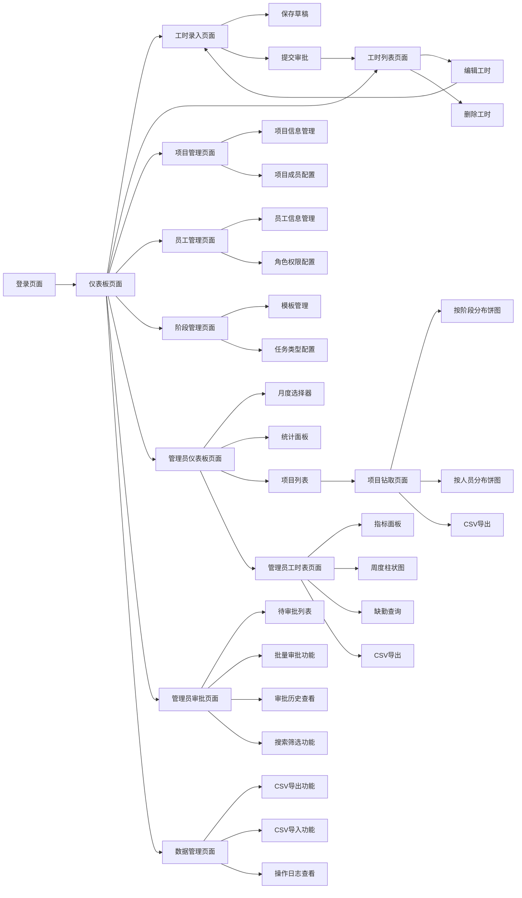

# PRMKit 产品需求文档

## 1. Product Overview

PRMKit是一个专业的项目资源管理工具包，主要用于企业内部的工时管理和项目资源跟踪。系统支持员工工时录入（15分钟增量自动计算）、多级审批流程、实时报表分析等核心功能，帮助企业提高项目管理效率和资源利用率。

该产品面向企业管理层、项目经理和普通员工，通过数字化手段解决传统工时管理中的效率低下、数据不准确、审批流程复杂等问题，为企业提供精确的项目成本控制和资源配置决策支持。系统采用现代化的Web技术栈，提供响应式设计，支持桌面端和移动端访问。

## 2. Core Features

### 2.1 User Roles

| Role                                             | Registration Method | Core Permissions                    |
| ------------------------------------------------ | ------------------- | ----------------------------------- |
| Level 1 Admin (DIRECTOR/ASSOCIATE/OFFICE\_ADMIN) | 系统管理员创建             | 系统全局管理、用户管理、项目管理、阶段管理、所有数据访问权限、报表导出、CSV导入导出 |
| Level 2 Manager (PROJECT\_MANAGER)               | 管理员邀请升级             | 工时表访问、团队工时审批、项目数据查看、审批统计查看          |
| Level 3 Worker (JUNIOR\_ARCHITECT/ARCHITECT)     | 管理员创建               | 个人工时录入、查看个人数据、提交审批申请、工时记录管理         |

### 2.2 Feature Module

我们的工时管理系统需求包含以下主要页面：

1. **登录页面**：用户身份验证、角色识别
2. **仪表板页面**：当前登陆者的数据概览、工时统计、项目进度展示、快捷操作
3. **管理员仪表板页面**：Level 1管理员专用的高级数据分析、月度统计、项目列表（新增）
4. **项目钻取页面**：项目详细分析、阶段和人员分布、工时统计（新增）
5. **管理员工时表页面**：全员工时监控、缺勤统计、周度分析（新增）
6. **工时列表页面**：当前登陆者的个人工时记录查看、状态跟踪、编辑删除
7. **工时录入页面**：当前登陆者的工时记录创建、15分钟增量计算、项目阶段选择
8. **项目管理页面**：项目信息管理、项目成员配置（仅管理员）
9. **员工管理页面**：员工信息管理、角色权限配置（仅管理员）
10. **阶段管理页面**：项目阶段模板管理、任务类型配置（仅管理员）
11. **管理员审批页面**：工时表审批管理、批量审批、审批历史查看（Level 1和Level 2管理员）
12. **数据管理页面**：CSV导入导出操作、数据备份、批量数据操作（仅Level 1管理员）

### 2.3 Page Details

| Page Name | Module Name | Feature description                                   | Status |
| --------- | ----------- | ----------------------------------------------------- | ------ |
| 登录页面      | 用户认证        | 支持邮箱密码登录，JWT token管理，角色权限验证，自动跳转到仪表板                  | ✅ 已完成  |
| 仪表板页面     | 数据概览        | 显示个人/团队工时统计、项目进度、待审批数量、图表可视化（Recharts饼图）              | ✅ 已完成  |
| 仪表板页面     | 快捷操作        | 快速工时录入入口、最近工时记录查看、统一导航菜单                              | ✅ 已完成  |
| 仪表板页面     | 权限控制        | 根据用户角色显示不同功能模块，Level 1显示管理功能，Level 2显示审批功能            | ✅ 已完成  |
| 仪表板页面     | 项目统计图表      | 项目工时分布饼图，支持时间范围筛选，实时数据更新                              | ✅ 已完成  |
| 工时录入页面    | 项目选择        | 下拉选择活跃项目和阶段，支持搜索过滤，显示项目基本信息                           | ✅ 已完成  |
| 工时录入页面    | 时间录入        | 日期选择器、开始结束时间选择（15分钟增量）、自动计算工时、时间冲突检测                  | ✅ 已完成  |
| 工时录入页面    | 工作描述        | 文本输入框，支持工作内容描述，表单验证                                   | ✅ 已完成  |
| 工时录入页面    | 提交管理        | 保存草稿、提交审批、编辑模式支持、状态跟踪                                 | ✅ 已完成  |
| 工时列表页面    | 工时记录        | 个人工时记录列表、状态筛选、日期范围查询、分页显示                             | ✅ 已完成  |
| 工时列表页面    | 记录操作        | 编辑工时、删除记录、查看详情、撤回提交、状态管理                              | ✅ 已完成  |
| 工时列表页面    | 搜索功能        | 支持按项目名称、项目代码、工作描述进行实时搜索，SQLite兼容                      | ✅ 已完成  |
| 项目管理页面    | 项目信息        | 项目基本信息管理、项目昵称管理、项目状态控制（ACTIVE/COMPLETED/SUSPENDED/CANCELLED） | ✅ 已完成  |
| 项目管理页面    | 项目操作        | 新增项目、编辑项目、删除项目、项目搜索（支持昵称搜索）、状态筛选                        | ✅ 已完成  |
| 员工管理页面    | 员工信息        | 员工基本信息管理、角色权限配置、状态控制、工号管理                             | ✅ 已完成  |
| 员工管理页面    | 员工操作        | 新增员工、编辑员工、删除员工、密码重置、角色变更                              | ✅ 已完成  |
| 阶段管理页面    | 模板管理        | 项目阶段模板管理、任务类型配置、分类管理（Administration/Design等）          | ✅ 已完成  |
| 阶段管理页面    | 模板操作        | 新增编辑删除模板、任务ID管理、状态控制、分类筛选                             | ✅ 已完成  |
| 管理员仪表板页面  | 月度选择器       | 月份选择器与URL同步、支持当前月和历史月份切换、状态保持                         | ✅ 已完成  |
| 管理员仪表板页面  | 统计面板        | 仅统计APPROVED状态工时、总工时数、项目数量、员工活跃度                       | ✅ 已完成  |
| 管理员仪表板页面  | 项目列表        | 显示项目名称、参与人数、已审批工时总计，支持点击跳转项目详情                        | ✅ 已完成  |
| 项目钻取页面    | 双饼图显示       | 按阶段分布饼图、按人员分布饼图、百分比和小时数显示                             | ✅ 已完成  |
| 项目钻取页面    | 未分配阶段处理     | "Unassigned Stage"处理未绑定阶段的工时记录                        | ✅ 已完成  |
| 项目钻取页面    | 导出功能        | CSV导出占位符、数据格式化、文件下载                                   | ✅ 已完成  |
| 管理员工时表页面  | 指标面板        | 提交数量统计、总工时统计、缺勤天数高亮显示（仅工作日）                           | 开发中    |
| 管理员工时表页面  | 周度柱状图       | 按周数聚合的柱状图、月内自然周定义、工时趋势分析                              | 开发中    |
| 管理员工时表页面  | 缺勤查询        | 快速查找缺勤天数、工作日规则、员工缺勤统计                                 | 开发中    |
| 管理员工时表页面  | CSV导出       | 工时数据CSV导出、格式化输出、批量数据处理                                | 开发中    |
| 管理员审批页面   | 待审批列表       | 显示所有待审批工时记录、按员工/项目/日期筛选、状态标识                          | ✅ 已完成  |
| 管理员审批页面   | 批量审批功能      | 多选工时记录、一键批量审批、批量拒绝、审批备注                               | ✅ 已完成  |
| 管理员审批页面   | 审批历史查看      | 已审批记录列表、审批时间、审批人、审批备注查看                               | ✅ 已完成  |
| 管理员审批页面   | 搜索筛选功能      | 按员工姓名、项目名称、日期范围、审批状态筛选                                | ✅ 已完成  |
| 管理员审批页面   | 权限控制        | Level 1和Level 2管理员访问权限、操作日志记录                         | ✅ 已完成  |
| 数据管理页面    | CSV导出功能     | 支持EMPLOYEE、PROJECT、TIMESHEET数据导出，生成标准CSV文件            | 开发中    |
| 数据管理页面    | CSV导入功能     | 支持批量数据导入，数据验证，错误处理，模板下载                           | 开发中    |
| 数据管理页面    | 操作日志        | 导入导出历史记录，操作结果追踪，错误日志查看                            | 开发中    |

## 3. Core Process

### 员工工时录入流程

1. 员工登录系统后进入仪表板
2. 点击工时录入或快捷录入按钮
3. 选择项目和对应阶段
4. 选择工作日期和时间段（系统自动按15分钟增量计算）
5. 填写工作描述
6. 保存为草稿或直接提交审批
7. 在工时列表页面查看和管理个人工时记录

### 管理员管理流程

1. Level 1管理员登录后可访问所有管理功能
2. 项目管理：创建项目、配置项目成员、管理项目状态
3. 员工管理：创建员工账户、分配角色权限、管理员工状态
4. 阶段管理：配置项目阶段模板、管理任务类型分类
5. 通过仪表板监控整体工时统计和项目进度

### 管理员高级分析流程（新增）

1. Level 1管理员访问管理员仪表板，选择分析月份
2. 查看月度统计面板：总工时、项目数量、员工活跃度
3. 浏览项目列表，查看各项目的参与人数和已审批工时总计
4. 点击项目列表项目进入项目钻取页面，查看详细分析
5. 在项目钻取页面查看双饼图：按阶段分布和按人员分布
6. 访问管理员工时表页面，监控全员工时提交情况
7. 查看周度工时趋势图，识别工时模式和异常
8. 使用缺勤查询功能，快速定位未提交工时的员工和日期
9. 导出CSV报表进行进一步分析和存档

### 管理员审批流程（新增）

1. Level 1和Level 2管理员登录后可访问管理员审批页面
2. 查看待审批工时列表，显示所有员工提交的工时记录
3. 使用搜索和筛选功能：按员工姓名、项目名称、日期范围筛选
4. 查看工时详情：员工信息、项目信息、工作时间、工作描述
5. 单个审批：点击审批或拒绝按钮，可添加审批备注
6. 批量审批：选择多个工时记录，执行批量审批或拒绝操作
7. 查看审批历史：已审批的工时记录、审批时间、审批人信息
8. 系统自动记录所有审批操作，生成审计日志

### 权限控制流程

1. 系统根据用户角色自动显示可访问的功能菜单
2. Level 1管理员：完全访问权限，包括所有管理功能和审批权限
3. Level 2经理：工时表访问权限和工时审批权限
4. Level 3员工：仅个人工时录入权限，无审批权限

### CSV数据管理流程（新增）

1. Level 1管理员访问数据管理页面
2. 选择数据类型（EMPLOYEE/PROJECT/TIMESHEET）
3. 导出流程：设置筛选条件，生成CSV文件，下载到本地
4. 导入流程：上传CSV文件，数据验证，预览结果，确认导入
5. 查看操作日志：导入导出历史，错误记录，操作追踪

## 4. User Interface Design

### 4.1 Design Style

* **主色调**：蓝色系 (#1890ff) 作为主色，灰色系 (#f5f5f5) 作为背景色

* **按钮样式**：Ant Design 5.x按钮组件，圆角设计（6px），主要操作使用type="primary"，次要操作使用type="default"，危险操作使用type="primary" danger

* **字体**：系统默认字体栈，标题使用 16px-20px，正文使用 14px，辅助信息使用 12px

* **布局风格**：卡片式布局，顶部导航栏，用户头像下拉菜单，响应式网格系统（Ant Design Row/Col）

* **图标风格**：使用 Ant Design Icons，线性图标风格，保持视觉一致性，支持主题色彩

* **组件库**：基于 Ant Design 5.26.7 组件库，统一的设计语言和交互规范

* **样式框架**：TailwindCSS 3.x 原子化CSS，与Ant Design组件完美结合

* **图表组件**：Chart.js + react-chartjs-2 用于数据可视化

### 4.2 Page Design Overview

| Page Name | Module Name | UI Elements                                               |
| --------- | ----------- | --------------------------------------------------------- |
| 登录页面      | 登录表单        | 居中卡片布局，蓝色主题，Ant Design Input组件，Button组件突出显示，表单验证提示        |
| 仪表板页面     | 统计卡片        | Row/Col网格布局，Statistic组件，白色卡片背景，彩色数字显示，图标装饰，Loading状态      |
| 仪表板页面     | 导航菜单        | 用户头像Avatar组件，Dropdown下拉菜单，权限控制显示，角色标识                     |
| 仪表板页面     | 数据图表        | Chart.js图表组件，趋势线图，饼图，响应式图表容器                              |
| 仪表板页面     | 数据表格        | Table组件，状态Tag标签，操作Button，分页Pagination，排序功能                |
| 工时录入页面    | 表单区域        | Form组件，DatePicker日期选择器，TimePicker时间选择器（15分钟增量），Select下拉选择 |
| 工时录入页面    | 操作按钮        | Button.Group按钮组，主次按钮区分，Loading状态反馈，确认对话框                  |
| 工时列表页面    | 列表视图        | Table组件，状态Tag标签，操作Button，筛选器Select和DatePicker，搜索框         |
| 工时列表页面    | 批量操作        | 行选择Checkbox，批量操作工具栏，确认Modal                               |
| 项目管理页面    | 管理界面        | Table组件，Modal弹窗，Form表单，状态Switch开关，搜索和筛选                   |
| 员工管理页面    | 管理界面        | Table组件，Modal弹窗，Form表单，角色Select选择器，状态Tag                  |
| 阶段管理页面    | 管理界面        | Table组件，Modal弹窗，Form表单，分类管理，任务ID输入验证                      |
| 管理员仪表板页面  | 月度选择器       | DatePicker.MonthPicker组件，URL同步，蓝色主题，历史月份支持                |
| 管理员仪表板页面  | 统计面板        | Statistic组件网格布局，数字高亮显示，图标装饰，Loading状态，APPROVED状态筛选        |
| 管理员仪表板页面  | 项目列表        | Card组件网格布局，项目名称显示，参与人数统计，工时总计，点击跳转交互                      |
| 项目钻取页面    | 双饼图显示       | Recharts PieChart组件，百分比标签，颜色主题一致，Tooltip显示详细信息            |
| 项目钻取页面    | 面包屑导航       | Breadcrumb组件，项目名称显示，返回链接，层级导航                             |
| 项目钻取页面    | 导出按钮        | Button组件，图标装饰，Loading状态，下载提示                              |
| 管理员工时表页面  | 指标面板        | Card组件布局，Alert高亮缺勤，Progress进度条，数字统计Statistic              |
| 管理员工时表页面  | 周度图表        | Recharts BarChart，周数标签，工时数值显示，颜色渐变，Tooltip交互              |
| 管理员工时表页面  | 缺勤查询        | Input.Search组件，Tag标签显示，List列表展示，快速定位功能                    |
| 管理员工时表页面  | CSV导出       | Button组件，文件图标，进度提示，成功反馈                                   |
| 管理员审批页面   | 待审批列表       | Table组件，状态Tag标签，员工Avatar头像，项目信息显示，日期格式化                   |
| 管理员审批页面   | 批量操作工具栏     | Checkbox多选，Button.Group操作按钮，Modal确认对话框，Progress进度条        |
| 管理员审批页面   | 审批历史表格      | Table组件，Timeline时间轴，审批人信息，备注Tooltip，分页Pagination          |
| 管理员审批页面   | 搜索筛选区域      | Input.Search搜索框，Select下拉筛选，DatePicker日期范围，Reset重置按钮       |
| 数据管理页面    | 数据类型选择      | Tab切换组件，支持EMPLOYEE/PROJECT/TIMESHEET切换                    |
| 数据管理页面    | 导入导出区域      | Upload文件上传组件，Button导出按钮，Progress进度条，Alert状态提示          |
| 数据管理页面    | 数据预览表格      | Table组件，验证状态Tag标签，错误提示Tooltip，批量操作Checkbox            |
| 数据管理页面    | 操作日志列表      | Table组件，时间排序，状态标识，操作结果显示，分页Pagination               |

### 4.3 Responsiveness

系统采用桌面优先的响应式设计，支持平板和移动设备适配。在移动端，左侧导航菜单自动收缩为抽屉式菜单，表格组件支持横向滚动，表单布局调整为单列显示。考虑触摸交互优化，按钮和点击区域适当增大，提升移动端用户体验。

## 5. 管理员功能权限与合规性（新增）

### 5.1 权限控制要求

* **Level 1专属访问**：管理员仪表板、项目钻取、管理员工时表页面仅限Level 1管理员（DIRECTOR/ASSOCIATE/OFFICE\_ADMIN）访问

* **服务端RBAC验证**：所有管理员API端点必须进行服务端角色验证，防止前端绕过

* **最小权限原则**：默认隐藏敏感字段，仅在必要时显示员工个人信息

* **审计日志**：记录所有管理员操作行为，包括数据访问、导出、筛选等操作

### 5.2 数据处理规范

* **时区处理**：统一使用Australia/Sydney时区，正确处理夏令时转换

* **工时精度**：显示保留一位小数，内部计算使用原始分钟数确保精度

* **周定义**：月内自然周定义，周一至周日为一周，跨月周数按月归属

* **工作日规则**：缺勤统计仅计算工作日（周一至周五），排除周末和公共假期

* **数据去重**：检测和处理重叠时间段，防止重复计时

### 5.3 性能与缓存策略

* **后端聚合**：数据库层面进行聚合计算，减少前端处理负担

* **前端缓存**：使用React Query缓存API响应，提升用户体验

* **分页加载**：大数据集采用分页或虚拟滚动，避免性能问题

* **索引优化**：添加数据库索引支持高效的时间范围和状态查询

### 5.4 用户体验统一性

* **组件复用**：最大化复用现有Ant Design组件，保持设计一致性

* **URL状态管理**：重要筛选参数同步到URL，支持书签和分享

* **面包屑导航**：提供清晰的页面层级导航，便于用户定位

* **空状态处理**：提供友好的空数据和错误状态提示

* **加载状态**：所有异步操作提供Loading状态反馈

