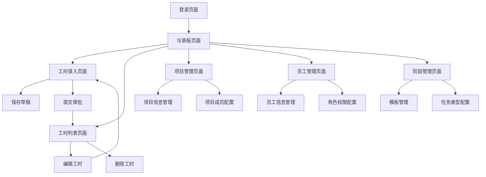

# PRMKit 产品需求文档

## 1. Product Overview

PRMKit是一个专业的项目资源管理工具包，主要用于企业内部的工时管理和项目资源跟踪。系统支持员工工时录入（15分钟增量自动计算）、多级审批流程、实时报表分析等核心功能，帮助企业提高项目管理效率和资源利用率。

该产品面向企业管理层、项目经理和普通员工，通过数字化手段解决传统工时管理中的效率低下、数据不准确、审批流程复杂等问题，为企业提供精确的项目成本控制和资源配置决策支持。系统采用现代化的Web技术栈，提供响应式设计，支持桌面端和移动端访问。

## 2. Core Features

### 2.1 User Roles

| Role                                             | Registration Method | Core Permissions                    |
| ------------------------------------------------ | ------------------- | ----------------------------------- |
| Level 1 Admin (DIRECTOR/ASSOCIATE/OFFICE\_ADMIN) | 系统管理员创建             | 系统全局管理、用户管理、项目管理、阶段管理、所有数据访问权限、报表导出 |
| Level 2 Manager (PROJECT\_MANAGER)               | 管理员邀请升级             | 工时表访问、团队工时审批、项目数据查看、审批统计查看          |
| Level 3 Worker (JUNIOR\_ARCHITECT/ARCHITECT)     | 管理员创建               | 个人工时录入、查看个人数据、提交审批申请、工时记录管理         |

### 2.2 Feature Module

我们的工时管理系统需求包含以下主要页面：

1. **登录页面**：用户身份验证、角色识别
2. **仪表板页面**：当前登陆者的数据概览、工时统计、项目进度展示、快捷操作
3. **工时列表页面**：当前登陆者的个人工时记录查看、状态跟踪、编辑删除
4. **工时录入页面**：当前登陆者的工时记录创建、15分钟增量计算、项目阶段选择
5. **项目管理页面**：项目信息管理、项目成员配置（仅管理员）
6. **员工管理页面**：员工信息管理、角色权限配置（仅管理员）
7. **阶段管理页面**：项目阶段模板管理、任务类型配置（仅管理员）

### 2.3 Page Details

| Page Name | Module Name | Feature description | Status |
| --------- | ----------- | ---------------------------------------------------- | ------ |
| 登录页面      | 用户认证        | 支持邮箱密码登录，JWT token管理，角色权限验证，自动跳转到仪表板 | ✅ 已完成 |
| 仪表板页面     | 数据概览        | 显示个人/团队工时统计、项目进度、待审批数量、图表可视化（Recharts饼图） | ✅ 已完成 |
| 仪表板页面     | 快捷操作        | 快速工时录入入口、最近工时记录查看、统一导航菜单 | ✅ 已完成 |
| 仪表板页面     | 权限控制        | 根据用户角色显示不同功能模块，Level 1显示管理功能，Level 2显示审批功能 | ✅ 已完成 |
| 仪表板页面     | 项目统计图表      | 项目工时分布饼图，支持时间范围筛选，实时数据更新 | ✅ 已完成 |
| 工时录入页面    | 项目选择        | 下拉选择活跃项目和阶段，支持搜索过滤，显示项目基本信息 | ✅ 已完成 |
| 工时录入页面    | 时间录入        | 日期选择器、开始结束时间选择（15分钟增量）、自动计算工时、时间冲突检测 | ✅ 已完成 |
| 工时录入页面    | 工作描述        | 文本输入框，支持工作内容描述，表单验证 | ✅ 已完成 |
| 工时录入页面    | 提交管理        | 保存草稿、提交审批、编辑模式支持、状态跟踪 | ✅ 已完成 |
| 工时列表页面    | 工时记录        | 个人工时记录列表、状态筛选、日期范围查询、分页显示 | ✅ 已完成 |
| 工时列表页面    | 记录操作        | 编辑工时、删除记录、查看详情、撤回提交、状态管理 | ✅ 已完成 |
| 工时列表页面    | 搜索功能        | 支持按项目名称、项目代码、工作描述进行实时搜索，SQLite兼容 | ✅ 已完成 |
| 项目管理页面    | 项目信息        | 项目基本信息管理、项目状态控制（ACTIVE/COMPLETED/SUSPENDED/CANCELLED） | ✅ 已完成 |
| 项目管理页面    | 项目操作        | 新增项目、编辑项目、删除项目、项目搜索、状态筛选 | ✅ 已完成 |
| 员工管理页面    | 员工信息        | 员工基本信息管理、角色权限配置、状态控制、工号管理 | ✅ 已完成 |
| 员工管理页面    | 员工操作        | 新增员工、编辑员工、删除员工、密码重置、角色变更 | ✅ 已完成 |
| 阶段管理页面    | 模板管理        | 项目阶段模板管理、任务类型配置、分类管理（Administration/Design等） | ✅ 已完成 |
| 阶段管理页面    | 模板操作        | 新增编辑删除模板、任务ID管理、状态控制、分类筛选 | ✅ 已完成 |

## 3. Core Process

### 员工工时录入流程

1. 员工登录系统后进入仪表板
2. 点击工时录入或快捷录入按钮
3. 选择项目和对应阶段
4. 选择工作日期和时间段（系统自动按15分钟增量计算）
5. 填写工作描述
6. 保存为草稿或直接提交审批
7. 在工时列表页面查看和管理个人工时记录

### 管理员管理流程

1. Level 1管理员登录后可访问所有管理功能
2. 项目管理：创建项目、配置项目成员、管理项目状态
3. 员工管理：创建员工账户、分配角色权限、管理员工状态
4. 阶段管理：配置项目阶段模板、管理任务类型分类
5. 通过仪表板监控整体工时统计和项目进度

### 权限控制流程

1. 系统根据用户角色自动显示可访问的功能菜单
2. Level 1管理员：完全访问权限
3. Level 2经理：工时表访问权限
4. Level 3员工：仅个人工时录入权限

## 4. User Interface Design

### 4.1 Design Style

* **主色调**：蓝色系 (#1890ff) 作为主色，灰色系 (#f5f5f5) 作为背景色

* **按钮样式**：Ant Design 5.x按钮组件，圆角设计（6px），主要操作使用type="primary"，次要操作使用type="default"，危险操作使用type="primary" danger

* **字体**：系统默认字体栈，标题使用 16px-20px，正文使用 14px，辅助信息使用 12px

* **布局风格**：卡片式布局，顶部导航栏，用户头像下拉菜单，响应式网格系统（Ant Design Row/Col）

* **图标风格**：使用 Ant Design Icons，线性图标风格，保持视觉一致性，支持主题色彩

* **组件库**：基于 Ant Design 5.26.7 组件库，统一的设计语言和交互规范

* **样式框架**：TailwindCSS 3.x 原子化CSS，与Ant Design组件完美结合

* **图表组件**：Chart.js + react-chartjs-2 用于数据可视化

### 4.2 Page Design Overview

| Page Name | Module Name | UI Elements                                               |
| --------- | ----------- | --------------------------------------------------------- |
| 登录页面      | 登录表单        | 居中卡片布局，蓝色主题，Ant Design Input组件，Button组件突出显示，表单验证提示        |
| 仪表板页面     | 统计卡片        | Row/Col网格布局，Statistic组件，白色卡片背景，彩色数字显示，图标装饰，Loading状态      |
| 仪表板页面     | 导航菜单        | 用户头像Avatar组件，Dropdown下拉菜单，权限控制显示，角色标识                     |
| 仪表板页面     | 数据图表        | Chart.js图表组件，趋势线图，饼图，响应式图表容器                              |
| 仪表板页面     | 数据表格        | Table组件，状态Tag标签，操作Button，分页Pagination，排序功能                |
| 工时录入页面    | 表单区域        | Form组件，DatePicker日期选择器，TimePicker时间选择器（15分钟增量），Select下拉选择 |
| 工时录入页面    | 操作按钮        | Button.Group按钮组，主次按钮区分，Loading状态反馈，确认对话框                  |
| 工时列表页面    | 列表视图        | Table组件，状态Tag标签，操作Button，筛选器Select和DatePicker，搜索框         |
| 工时列表页面    | 批量操作        | 行选择Checkbox，批量操作工具栏，确认Modal                               |
| 项目管理页面    | 管理界面        | Table组件，Modal弹窗，Form表单，状态Switch开关，搜索和筛选                   |
| 员工管理页面    | 管理界面        | Table组件，Modal弹窗，Form表单，角色Select选择器，状态Tag                  |
| 阶段管理页面    | 管理界面        | Table组件，Modal弹窗，Form表单，分类管理，任务ID输入验证                      |

### 4.3 Responsiveness

系统采用桌面优先的响应式设计，支持平板和移动设备适配。在移动端，左侧导航菜单自动收缩为抽屉式菜单，表格组件支持横向滚动，表单布局调整为单列显示。考虑触摸交互优化，按钮和点击区域适当增大，提升移动端用户体验。
