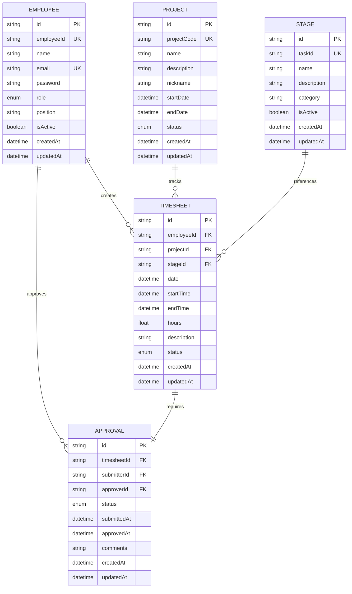

# PRMKit 技术架构文档

## 1. Architecture design


## 2. Technology Description

* **Frontend**: React\@18 + TypeScript + Vite + Ant Design\@5.26.7 + TailwindCSS\@3 + React Router

* **Backend**: Node.js + Express\@4 + TypeScript + Nodemon (开发环境) + CORS + Helmet

* **Database**: SQLite + <Prisma@5.x> (ORM) with Row Level Security

* **Authentication**: JWT + bcryptjs 密码加密

* **State Management**: Zustand + React Query (@tanstack/react-query)

* **HTTP Client**: Axios

* **Charts**: Chart.js + react-chartjs-2 + Recharts (管理员功能)

* **Search**: SQLite兼容的模糊搜索实现，支持项目名称、代码和描述搜索

* **Development**: Vite + ESLint + Prettier + TypeScript + Nodemon + Concurrently + Hot Reload

* **UI Components**: Ant Design Icons + Ant Design Components

* **Date Handling**: dayjs + date-fns-tz (时区处理)

* **Testing**: 完整功能测试已完成，所有核心功能验证通过

* **Performance**: API响应时间 < 500ms，数据库查询 < 200ms，前端渲染 < 100ms

## 3. Route definitions

| Route                        | Purpose                             |
| ---------------------------- | ----------------------------------- |
| /                            | 首页重定向到仪表板                           |
| /login                       | 用户登录页面，JWT身份验证                      |
| /dashboard                   | 仪表板页面，显示工时统计和项目概览                   |
| /timesheets/new              | 工时录入页面，支持项目选择和时间计算                  |
| /timesheets                  | 工时列表页面，个人工时记录管理                     |
| /timesheets/:id/edit         | 工时编辑页面，修改已有工时记录                     |
| /admin/projects              | 项目管理页面，项目信息和成员管理（仅管理员）              |
| /admin/employees             | 员工管理页面，员工信息和角色管理（仅管理员）              |
| /admin/stages                | 阶段管理页面，项目阶段模板管理（仅管理员）               |
| /admin/dashboard             | 管理员仪表板页面，高级数据分析（仅Level 1管理员）        |
| /admin/project/:id/drilldown | 项目钻取页面，项目详细分析（仅Level 1管理员）          |
| /admin/timesheets            | 管理员工时表页面，全员工时监控（仅Level 1管理员）        |
| /admin/approvals             | 管理员审批页面，工时表审批管理（Level 1和Level 2管理员） |

## 4. API definitions

### 4.1 Authentication API

**用户登录**

```
POST /api/auth/login
GET /api/auth/me
POST /api/auth/users
GET /api/auth/users
PUT /api/auth/users/:id
```

Request (POST /api/auth/login):

| Param Name | Param Type | isRequired | Description |
| ---------- | ---------- | ---------- | ----------- |
| employeeId | string     | true       | 员工ID        |
| password   | string     | true       | 用户密码        |

Response:

| Param Name | Param Type | Description    |
| ---------- | ---------- | -------------- |
| success    | boolean    | 登录状态           |
| token      | string     | JWT访问令牌        |
| user       | object     | 用户信息对象（包含6级角色） |

Example:

```json
{
  "employeeId": "ARCH001",
  "password": "password123"
}
```

### 4.2 Timesheet API

**工时记录管理**

```
GET /api/timesheets - 获取工时记录列表（支持搜索和筛选）
POST /api/timesheets - 创建工时记录
GET /api/timesheets/:id - 获取单个工时记录
PUT /api/timesheets/:id - 更新工时记录
DELETE /api/timesheets/:id - 删除工时记录
PUT /api/timesheets/:id/submit - 提交工时记录
POST /api/timesheets/batch-approve - 批量审批
```

**工时搜索功能**

Request Parameters (GET /api/timesheets):

| Param Name | Param Type | isRequired | Description            |
| ---------- | ---------- | ---------- | ---------------------- |
| search     | string     | false      | 搜索关键词，支持项目名称、项目代码、工作描述 |
| page       | number     | false      | 页码，默认1                 |
| limit      | number     | false      | 每页数量，默认10              |
| projectId  | string     | false      | 项目ID筛选                 |
| status     | string     | false      | 状态筛选                   |

Request (POST /api/timesheets):

| Param Name  | Param Type | isRequired | Description       |
| ----------- | ---------- | ---------- | ----------------- |
| projectId   | string     | true       | 项目ID              |
| stageId     | string     | false      | 阶段ID              |
| date        | string     | true       | 工作日期 (YYYY-MM-DD) |
| startTime   | string     | true       | 开始时间 (HH:mm)      |
| endTime     | string     | true       | 结束时间 (HH:mm)      |
| description | string     | false      | 工作描述              |

### 4.3 Project API

**项目管理**

```
GET /api/projects - 获取项目列表
POST /api/projects - 创建项目
GET /api/projects/:id - 获取单个项目
PUT /api/projects/:id - 更新项目
DELETE /api/projects/:id - 删除项目
```

Request (POST /api/projects):

| Param Name  | Param Type | isRequired | Description |
| ----------- | ---------- | ---------- | ----------- |
| projectCode | string     | true       | 项目代码        |
| name        | string     | true       | 项目名称        |
| description | string     | false      | 项目描述        |
| nickname    | string     | false      | 项目昵称        |
| startDate   | string     | true       | 开始日期 (YYYY-MM-DD) |
| endDate     | string     | false      | 结束日期 (YYYY-MM-DD) |
| status      | string     | false      | 项目状态，默认ACTIVE |

Request (PUT /api/projects/:id):

| Param Name  | Param Type | isRequired | Description |
| ----------- | ---------- | ---------- | ----------- |
| projectCode | string     | false      | 项目代码        |
| name        | string     | false      | 项目名称        |
| description | string     | false      | 项目描述        |
| nickname    | string     | false      | 项目昵称        |
| startDate   | string     | false      | 开始日期 (YYYY-MM-DD) |
| endDate     | string     | false      | 结束日期 (YYYY-MM-DD) |
| status      | string     | false      | 项目状态        |

Response (项目对象):

| Param Name  | Param Type | Description |
| ----------- | ---------- | ----------- |
| id          | string     | 项目ID        |
| projectCode | string     | 项目代码        |
| name        | string     | 项目名称        |
| description | string     | 项目描述        |
| nickname    | string     | 项目昵称        |
| startDate   | string     | 开始日期        |
| endDate     | string     | 结束日期        |
| status      | string     | 项目状态        |
| createdAt   | string     | 创建时间        |
| updatedAt   | string     | 更新时间        |

### 4.4 Employee API

**员工管理**

```
GET /api/employees - 获取员工列表
POST /api/employees - 创建员工
GET /api/employees/:id - 获取单个员工
PUT /api/employees/:id - 更新员工
DELETE /api/employees/:id - 删除员工
GET /api/employees/stats - 获取员工统计
```

### 4.5 Stage API

**阶段管理**

```
GET /api/stages - 获取阶段列表
POST /api/stages - 创建阶段
GET /api/stages/:id - 获取单个阶段
PUT /api/stages/:id - 更新阶段
DELETE /api/stages/:id - 删除阶段
GET /api/stages/categories/list - 获取分类列表
```

### 4.6 Approval API

**审批管理**

```
GET /api/approvals - 获取审批列表
PUT /api/approvals/:id/approve - 审批通过
PUT /api/approvals/batch/approve - 批量审批
POST /api/approvals/:id/reject - 审批拒绝
GET /api/approvals/stats/summary - 审批统计摘要
GET /api/approvals/my/workload - 我的工作负荷
```

### 4.7 Reports API

**报表统计**

```
GET /api/reports/dashboard - 仪表板统计数据
GET /api/reports/timesheets - 工时汇总报表
GET /api/reports/timesheet-summary - 工时汇总报表
GET /api/reports/project-summary - 项目汇总报表
```

### 4.8 Admin Dashboard API（新增）

**管理员仪表板数据**

```
GET /api/reports/admin/dashboard - 管理员仪表板统计（仅Level 1）
GET /api/reports/project/:projectId/drilldown - 项目钻取数据（仅Level 1）
GET /api/reports/admin/timesheets - 管理员工时表数据（仅Level 1）
GET /api/reports/admin/missing-days - 缺勤天数查询（仅Level 1）
POST /api/reports/admin/export/csv - CSV导出（仅Level 1）
```

### 4.9 Admin Approval API（新增）

**管理员审批管理**

```
GET /api/admin/approvals/pending - 获取待审批工时列表（Level 1和Level 2）
POST /api/admin/approvals/batch-approve - 批量审批工时（Level 1和Level 2）
POST /api/admin/approvals/batch-reject - 批量拒绝工时（Level 1和Level 2）
GET /api/admin/approvals/history - 获取审批历史（Level 1和Level 2）
PUT /api/admin/approvals/:id/approve - 单个审批通过（Level 1和Level 2）
PUT /api/admin/approvals/:id/reject - 单个审批拒绝（Level 1和Level 2）
```

Request (GET /api/admin/approvals/pending):

| Param Name | Param Type | isRequired | Description       |
| ---------- | ---------- | ---------- | ----------------- |
| page       | number     | false      | 页码，默认1            |
| limit      | number     | false      | 每页数量，默认20         |
| search     | string     | false      | 搜索关键词（员工姓名、项目名称）  |
| employeeId | string     | false      | 员工ID筛选            |
| projectId  | string     | false      | 项目ID筛选            |
| dateFrom   | string     | false      | 开始日期 (YYYY-MM-DD) |
| dateTo     | string     | false      | 结束日期 (YYYY-MM-DD) |

Response:

| Param Name | Param Type | Description |
| ---------- | ---------- | ----------- |
| data       | array      | 待审批工时记录列表   |
| total      | number     | 总记录数        |
| page       | number     | 当前页码        |
| totalPages | number     | 总页数         |

Request (POST /api/admin/approvals/batch-approve):

| Param Name   | Param Type | isRequired | Description |
| ------------ | ---------- | ---------- | ----------- |
| timesheetIds | array      | true       | 工时记录ID数组    |
| comments     | string     | false      | 审批备注        |

Response:

| Param Name | Param Type | Description |
| ---------- | ---------- | ----------- |
| success    | boolean    | 操作状态        |
| approved   | number     | 成功审批数量      |
| failed     | number     | 失败数量        |
| message    | string     | 操作结果信息      |

Request (GET /api/reports/admin/dashboard):

| Param Name | Param Type | isRequired | Description    |
| ---------- | ---------- | ---------- | -------------- |
| month      | string     | true       | 查询月份 (YYYY-MM) |

Response:

| Param Name      | Param Type | Description       |
| --------------- | ---------- | ----------------- |
| totalHours      | number     | 总工时数（仅APPROVED状态） |
| totalProjects   | number     | 活跃项目数量            |
| activeEmployees | number     | 活跃员工数量            |
| projectList     | array      | 项目列表数据            |

Request (GET /api/reports/project/:projectId/drilldown):

| Param Name | Param Type | isRequired | Description    |
| ---------- | ---------- | ---------- | -------------- |
| month      | string     | true       | 查询月份 (YYYY-MM) |
| projectId  | string     | true       | 项目ID（URL参数）    |

Response:

| Param Name            | Param Type | Description |
| --------------------- | ---------- | ----------- |
| projectInfo           | object     | 项目基本信息      |
| stageDistribution     | array      | 按阶段分布数据     |
| personnelDistribution | array      | 按人员分布数据     |
| totalHours            | number     | 项目总工时       |
| unassignedHours       | number     | 未分配阶段工时     |

## 5. Server architecture diagram


## 6. Data model

### 6.1 Data model definition



### 6.1.1 数据权限控制

**用户数据隔离原则**：

* 所有用户只能查看和操作自己的数据

* 通过 `employeeId: req.user!.userId` 实现数据过滤

* 移除基于用户级别的权限控制，统一使用用户ID过滤

**实现细节**：

* 个人工时表：仅显示当前用户的工时记录

* 个人仪表板：仅统计当前用户的工时数据和趋势

* 审批流程：用户只能看到自己提交的审批记录

* 数据导出：仅导出当前用户相关的数据

### 6.2 Data Definition Language

**员工表 (employees)**

```sql
-- 创建员工表
CREATE TABLE employees (
    id TEXT PRIMARY KEY,
    employeeId TEXT UNIQUE NOT NULL,
    name TEXT NOT NULL,
    email TEXT UNIQUE NOT NULL,
    password TEXT NOT NULL,
    role TEXT DEFAULT 'DIRECTOR' CHECK (role IN ('DIRECTOR', 'ASSOCIATE', 'OFFICE_ADMIN', 'PROJECT_MANAGER', 'JUNIOR_ARCHITECT', 'ARCHITECT')),
    position TEXT,
    isActive BOOLEAN DEFAULT 1,
    createdAt DATETIME DEFAULT CURRENT_TIMESTAMP,
    updatedAt DATETIME DEFAULT CURRENT_TIMESTAMP
);

-- 创建索引
CREATE INDEX idx_employees_email ON employees(email);
CREATE INDEX idx_employees_employeeId ON employees(employeeId);
```

**项目表 (projects)**

```sql
-- 创建项目表
CREATE TABLE projects (
    id TEXT PRIMARY KEY,
    projectCode TEXT UNIQUE NOT NULL,
    name TEXT NOT NULL,
    description TEXT,
    nickname TEXT,
    startDate DATETIME NOT NULL,
    endDate DATETIME,
    status TEXT DEFAULT 'ACTIVE' CHECK (status IN ('ACTIVE', 'COMPLETED', 'SUSPENDED', 'CANCELLED')),
    stage TEXT,
    createdAt DATETIME DEFAULT CURRENT_TIMESTAMP,
    updatedAt DATETIME DEFAULT CURRENT_TIMESTAMP
);

-- 创建索引
CREATE INDEX idx_projects_code ON projects(projectCode);
CREATE INDEX idx_projects_status ON projects(status);
```

**工时表 (timesheets)**

```sql
-- 创建工时表
CREATE TABLE timesheets (
    id TEXT PRIMARY KEY,
    employeeId TEXT NOT NULL,
    projectId TEXT NOT NULL,
    stageId TEXT,
    date DATETIME NOT NULL,
    startTime DATETIME NOT NULL,
    endTime DATETIME NOT NULL,
    hours REAL NOT NULL,
    description TEXT,
    status TEXT DEFAULT 'DRAFT' CHECK (status IN ('DRAFT', 'SUBMITTED', 'APPROVED')),
    createdAt DATETIME DEFAULT CURRENT_TIMESTAMP,
    updatedAt DATETIME DEFAULT CURRENT_TIMESTAMP,
    FOREIGN KEY (employeeId) REFERENCES employees(id) ON DELETE CASCADE,
    FOREIGN KEY (projectId) REFERENCES projects(id) ON DELETE CASCADE,
    FOREIGN KEY (stageId) REFERENCES stages(id) ON DELETE SET NULL
);

-- 创建索引和唯一约束
CREATE UNIQUE INDEX idx_timesheets_unique ON timesheets(employeeId, projectId, date, startTime);
CREATE INDEX idx_timesheets_employee ON timesheets(employeeId);
CREATE INDEX idx_timesheets_project ON timesheets(projectId);
CREATE INDEX idx_timesheets_stage ON timesheets(stageId);
CREATE INDEX idx_timesheets_date ON timesheets(date);
CREATE INDEX idx_timesheets_status ON timesheets(status);
-- 管理员功能优化索引（新增）
CREATE INDEX idx_timesheets_project_date_status ON timesheets(projectId, date, status);
CREATE INDEX idx_timesheets_date_status_approved ON timesheets(date, status) WHERE status = 'APPROVED';
CREATE INDEX idx_timesheets_month_status ON timesheets(strftime('%Y-%m', date), status);
```

**审批表 (approvals)**

```sql
-- 创建审批表
CREATE TABLE approvals (
    id TEXT PRIMARY KEY,
    timesheetId TEXT UNIQUE NOT NULL,
    submitterId TEXT NOT NULL,
    approverId TEXT,
    status TEXT DEFAULT 'PENDING' CHECK (status IN ('PENDING', 'APPROVED')),
    submittedAt DATETIME DEFAULT CURRENT_TIMESTAMP,
    approvedAt DATETIME,
    comments TEXT,
    createdAt DATETIME DEFAULT CURRENT_TIMESTAMP,
    updatedAt DATETIME DEFAULT CURRENT_TIMESTAMP,
    FOREIGN KEY (timesheetId) REFERENCES timesheets(id) ON DELETE CASCADE,
    FOREIGN KEY (submitterId) REFERENCES employees(id) ON DELETE CASCADE,
    FOREIGN KEY (approverId) REFERENCES employees(id) ON DELETE SET NULL
);

-- 创建索引
CREATE INDEX idx_approvals_status ON approvals(status);
CREATE INDEX idx_approvals_submitter ON approvals(submitterId);
CREATE INDEX idx_approvals_approver ON approvals(approverId);
```

**阶段表 (stages)**

```sql
-- 创建阶段表
CREATE TABLE stages (
    id TEXT PRIMARY KEY,
    taskId TEXT UNIQUE NOT NULL,
    name TEXT NOT NULL,
    description TEXT,
    category TEXT NOT NULL,
    isActive BOOLEAN DEFAULT 1,
    createdAt DATETIME DEFAULT CURRENT_TIMESTAMP,
    updatedAt DATETIME DEFAULT CURRENT_TIMESTAMP
);

-- 创建索引
CREATE INDEX idx_stages_taskId ON stages(taskId);
CREATE INDEX idx_stages_category ON stages(category);
CREATE INDEX idx_stages_active ON stages(isActive);
```

**初始化数据**

```sql
-- 插入管理员用户 (基于 seed.ts 实际数据)
INSERT INTO employees (id, employeeId, name, email, password, role, position, isActive)
VALUES 
('saiyu-001', 'SAIYU_001', 'Admin User', 'gzhan@saiyu.com.au', '$2b$10$hashedpassword', 'DIRECTOR', 'Director', 1),
('psec-101', 'PSEC_101', 'John Associate', 'associate@prmkit.com', '$2b$10$hashedpassword', 'ASSOCIATE', 'Associate Partner', 1),
('psec-102', 'PSEC_102', 'Sarah Office', 'office@prmkit.com', '$2b$10$hashedpassword', 'OFFICE_ADMIN', 'Office Administrator', 1),
('psec-103', 'PSEC_103', 'Mike PM', 'pm@prmkit.com', '$2b$10$hashedpassword', 'PROJECT_MANAGER', 'Project Manager', 1),
('psec-104', 'PSEC_104', 'Lisa Arch', 'arch@prmkit.com', '$2b$10$hashedpassword', 'ARCHITECT', 'Senior Architect', 1),
('psec-105', 'PSEC_105', 'Tom Junior', 'junior@prmkit.com', '$2b$10$hashedpassword', 'JUNIOR_ARCHITECT', 'Junior Architect', 1);

-- 插入示例项目 (基于 seed.ts 实际数据)
INSERT INTO projects (id, projectCode, name, description, startDate, status, stage)
VALUES 
('proj-001', 'PROJ001', 'Sample Residential Project', 'A sample residential development project', '2025-01-09', 'ACTIVE', 'Design Phase'),
('proj-002', 'PROJ002', 'Commercial Office Building', 'A commercial office building project', '2025-01-09', 'ACTIVE', 'Construction Documentation'),
('proj-003', 'PROJ003', 'Mixed Use Development', 'A mixed use residential and commercial development', '2025-01-09', 'ACTIVE', 'Development Application');

-- 插入阶段数据 (基于 seed.ts 完整阶段数据)
INSERT INTO stages (id, taskId, name, description, category, isActive)
VALUES 
-- 管理和休假类别 (TD.00.xx)
('stage-001', 'TD.00.00', 'Administration', 'e.g. Extended Lunch break, Morning and Afternoon Tea, Toilet break', 'Administration', 1),
('stage-002', 'TD.00.01', 'Sick Leave', 'Sick Leave', 'Leave', 1),
('stage-003', 'TD.00.02', 'Annual Leave / Public Holidays', 'Annual Leave / Public Holidays', 'Leave', 1),
('stage-004', 'TD.00.03', 'Leave - Other entitlements', 'personal and carer''s leave, compassionate leave, family and domestic violence leave, community service leave, long service leave', 'Leave', 1),
('stage-005', 'TD.00.04', 'Office Management', 'e.g. IT issue, Annual Fire Safety Event', 'Administration', 1),

-- 设计和建筑类别 (TD.01.xx)
('stage-006', 'TD.01.00', 'SK', 'Sketch Design / Concept Design Work', 'Design', 1),
('stage-007', 'TD.01.01', 'DA / CDC', 'Development Application / Complying Development Certificate Work', 'Design', 1),
('stage-008', 'TD.01.02', 'CC', 'Construction Certificate Application Work', 'Design', 1),
('stage-009', 'TD.01.03', 'CD', 'Construction Documentation Work', 'Design', 1),
('stage-010', 'TD.01.04', 'ID', 'Interior Design Work', 'Design', 1),
('stage-011', 'TD.01.09', 'MK', 'Marketing Material Work (e.g. Marketing Plans, Inclusions Lists, CGIs)', 'Marketing', 1),
('stage-012', 'TD.01.10', 'OW', 'Other Consulting Work (e.g. Feasibility Studies, Planning Portal Assistance, Design / Document Reviews)', 'Consulting', 1),

-- 项目管理类别 (TD.02.xx)
('stage-013', 'TD.02.01', 'PM', 'General Project Management Work', 'Management', 1),
('stage-014', 'TD.02.02', 'OC', 'Occupation Certificate Application Work', 'Management', 1),
('stage-015', 'TD.02.03', 'POC', 'Post OC Work (e.g. Final Certificate Assessment, SBBIS)', 'Management', 1),
('stage-016', 'TD.02.04', 'Contract Administration Work', 'Management', 1);
```

## 7. 管理员功能技术实现（新增）

### 7.1 前端技术栈扩展

* **React Query (@tanstack/react-query)**: 数据缓存和状态管理，提升管理员页面性能

* **date-fns-tz**: 时区处理库，支持Australia/Sydney时区和夏令时

* **Recharts**: 图表库升级，支持交互式柱状图和双饼图

* **React Router**: URL状态管理，支持查询参数同步

### 7.2 后端中间件增强

```typescript
// Level 1管理员权限中间件
const requireLevel1Admin = (req: Request, res: Response, next: NextFunction) => {
  const user = req.user;
  if (!user || !['DIRECTOR', 'ASSOCIATE', 'OFFICE_ADMIN'].includes(user.role)) {
    return res.status(403).json({ error: 'Level 1 Admin access required' });
  }
  next();
};

// Level 1和Level 2管理员权限中间件（用于审批功能）
const requireManagerAccess = (req: Request, res: Response, next: NextFunction) => {
  const user = req.user;
  if (!user || !['DIRECTOR', 'ASSOCIATE', 'OFFICE_ADMIN', 'PROJECT_MANAGER'].includes(user.role)) {
    return res.status(403).json({ error: 'Manager access required for approval operations' });
  }
  next();
};

// 审计日志中间件
const auditLogger = (action: string) => {
  return (req: Request, res: Response, next: NextFunction) => {
    // 记录管理员操作
    console.log(`[AUDIT] ${req.user?.employeeId} - ${action} - ${new Date().toISOString()}`);
    next();
  };
};
```

### 7.3 数据库查询优化

```sql
-- 管理员仪表板月度统计查询
SELECT 
  p.name as projectName,
  p.projectCode,
  SUM(t.hours) as totalHours,
  COUNT(DISTINCT t.employeeId) as employeeCount
FROM timesheets t
JOIN projects p ON t.projectId = p.id
WHERE t.status = 'APPROVED'
  AND strftime('%Y-%m', t.date) = ?
GROUP BY t.projectId, p.name, p.projectCode
ORDER BY totalHours DESC;

-- 项目钻取阶段分布查询
SELECT 
  COALESCE(s.name, 'Unassigned Stage') as stageName,
  SUM(t.hours) as hours,
  COUNT(*) as entryCount
FROM timesheets t
LEFT JOIN stages s ON t.stageId = s.id
WHERE t.projectId = ? 
  AND t.status = 'APPROVED'
  AND strftime('%Y-%m', t.date) = ?
GROUP BY t.stageId, s.name;
```

### 7.4 性能监控指标

* **API响应时间**: 管理员API端点响应时间 < 500ms

* **数据库查询**: 复杂聚合查询执行时间 < 200ms

* **前端渲染**: 图表组件渲染时间 < 100ms

* **缓存命中率**: React Query缓存命中率 > 80%

### 7.5 安全性要求

* **RBAC验证**: 所有管理员端点必须通过服务端角色验证

* **审批权限控制**: Level 1和Level 2管理员可执行审批操作，Level 3员工无审批权限

* **数据脱敏**: 导出数据中敏感信息自动脱敏处理

* **操作审计**: 所有数据访问、导出和审批操作记录审计日志

* **审批日志**: 记录审批人、审批时间、审批结果和备注信息

* **会话管理**: JWT令牌有效期控制，防止长期会话风险

* **批量操作限制**: 批量审批操作设置合理的数量限制，防止系统过载

